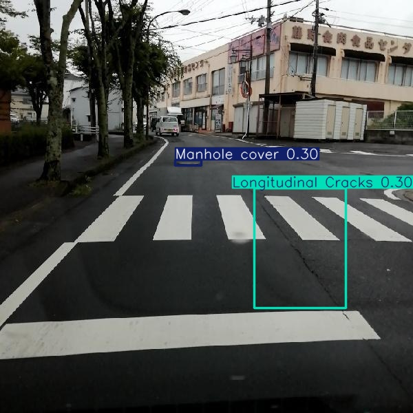
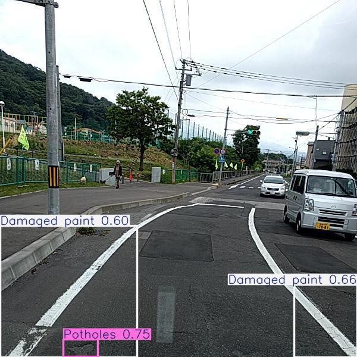
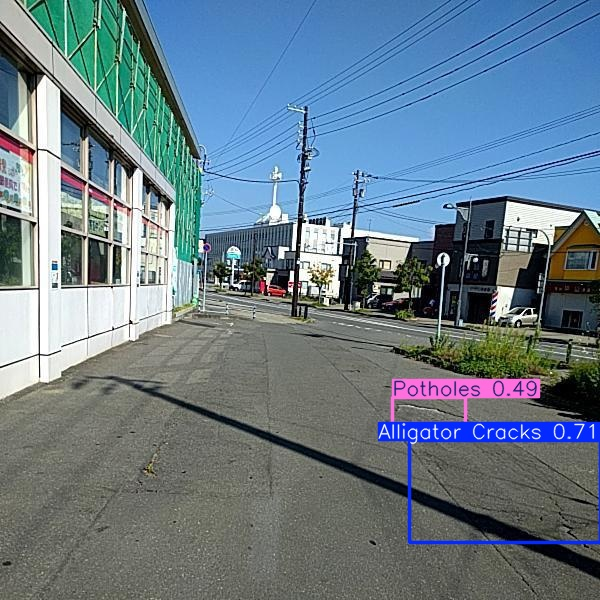
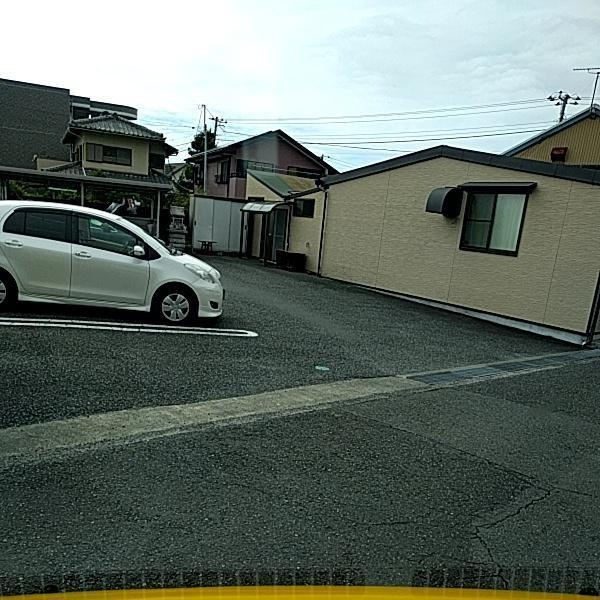

# 🚧 Road Damage Detection

A computer vision system that automatically detects and classifies road surface damage from dashcam images. Fine-tuned YOLOv8s on the RDD2022 dataset across 7 damage categories, wrapped in a production-ready FastAPI inference endpoint.

**[🚀 Live Demo](https://huggingface.co/spaces/krajshivam/road-damage-detection)** | **[GitHub](https://github.com/krajshivam/road-damage-detection)**

---

## 🎯 Results

| Metric | Score |
|--------|-------|
| mAP50 | 0.586 |
| mAP50-95 | 0.312 |
| Precision | 0.643 |
| Recall | 0.559 |
| Inference Speed | ~50ms per image |

### Per-Class Performance

| Class | AP50 |
|-------|------|
| Manhole Cover | 0.877 |
| Damaged Crosswalk | 0.797 |
| Alligator Cracks | 0.609 |
| Damaged Paint | 0.551 |
| Potholes | 0.556 |
| Longitudinal Cracks | 0.367 |
| Transverse Cracks | 0.344 |

Manhole covers and crosswalks score highest due to their visually distinct patterns. Longitudinal and transverse cracks score lowest — both are thin line features that are visually similar and occupy few pixels at 640×640 resolution.

---

## 🏗️ Project Structure

```
road-damage-detection/
├── dataset/               # RDD2022 dataset (not tracked in git)
│   ├── train/
│   ├── valid/
│   └── test/
├── runs/
│   └── best.pt            # Best model weights (download separately)
├── assets/                # Sample prediction images for README
├── scripts/
│   └── download_data.py   # Dataset download instructions
├── train.py               # Training script
├── evaluate.py            # Evaluation and prediction visualization
├── api.py                 # FastAPI inference server
├── streamlit_app.py       # Streamlit demo UI (Hugging Face Spaces)
├── data.yaml              # Dataset configuration
└── pyproject.toml         # Dependencies managed with uv
```

---

## 📦 Dataset

- **Source:** RDD2022 (Road Damage Dataset 2022) — used in IEEE BigData Cup 2022
- **Distribution:** Roboflow ([link](https://universe.roboflow.com/new-workspace-kj87b/road-damage-detection-iicdh/dataset/10))
- **Size:** 8,586 images, 7 damage classes
- **Split:** ~70% train / 20% val / 10% test
- **License:** CC BY 4.0

---

## 🧠 Model

- **Architecture:** YOLOv8s (11.2M parameters, pretrained on COCO)
- **Training hardware:** Nvidia Tesla T4 GPU (Google Colab)
- **Training duration:** 91 epochs, best checkpoint at epoch 53
- **Key finding:** Overfitting observed after epoch 53 — YOLOv8's built-in model selection saved best weights automatically

---

## 🚀 Running the API Locally

### 1. Install dependencies

```bash
uv install
```

### 2. Download model weights

Download `best.pt` from the [Releases](https://github.com/krajshivam/road-damage-detection/releases) page and place it in `runs/`.

### 3. Start the server

```bash
uv run uvicorn api:app --reload
```

Server runs at `http://127.0.0.1:8000`

### 4. Interactive API docs

Open in browser:
```
http://127.0.0.1:8000/docs
```

FastAPI auto-generates interactive documentation — upload an image and test directly from the browser.

### 5. Test with curl

```bash
curl -X POST "http://127.0.0.1:8000/predict" \
     -F "file=@your_road_image.jpg"
```

### Sample Response

```json
{
  "filename": "road.jpg",
  "image_size": { "width": 600, "height": 600 },
  "detections": [
    {
      "class_id": 1,
      "class_name": "Damaged crosswalk",
      "confidence": 0.8839,
      "bbox_xyxy": [0.0, 409.04, 538.08, 543.84]
    },
    {
      "class_id": 4,
      "class_name": "Manhole cover",
      "confidence": 0.7064,
      "bbox_xyxy": [160.22, 386.59, 220.8, 401.26]
    }
  ],
  "total_detections": 2,
  "latency_ms": 48.4,
  "conf_threshold": 0.25
}
```

---

## 📊 Sample Predictions






---

## 🔍 Key Findings

- **Manhole covers (AP50: 0.877)** — circular metallic objects with unique shape, easiest class to detect
- **Crack classes (AP50: 0.34–0.37)** — thin line features that are orientation-sensitive and low-contrast; primary area for improvement
- **Overfitting after epoch 53** — validation mAP peaked then declined; early stopping would have been appropriate
- **Distribution shift** — model trained on dashcam perspective images performs poorly on close-up or aerial road photos; a known limitation of the training data

---

## 🛠️ Tech Stack

| Component | Tool |
|-----------|------|
| Model | Ultralytics YOLOv8s |
| Training | Google Colab (Nvidia Tesla T4 GPU) |
| API Framework | FastAPI + Uvicorn |
| Demo UI | Streamlit |
| Deployment | Hugging Face Spaces |
| Image Processing | Pillow, OpenCV |
| Package Manager | uv |
| Dataset | RDD2022 via Roboflow (CC BY 4.0) |
| Version Control | Git + GitHub |

---

## 📁 Reproducing This Project

1. Clone the repo
   ```bash
   git clone https://github.com/krajshivam/road-damage-detection.git
   cd road-damage-detection
   ```

2. Install dependencies
   ```bash
   uv install
   ```

3. Download the dataset from [Roboflow](https://universe.roboflow.com/new-workspace-kj87b/road-damage-detection-iicdh/dataset/10) in YOLOv8 format and place in `dataset/`

4. Download `best.pt` from Releases and place in `runs/`

5. Run evaluation
   ```bash
   uv run evaluate.py
   ```

6. Start the API
   ```bash
   uv run uvicorn api:app --reload
   ```

---

## 👤 Author

**Shivam K Raj**
BTech ECE, MNNIT Allahabad (2022)
[GitHub](https://github.com/krajshivam)
